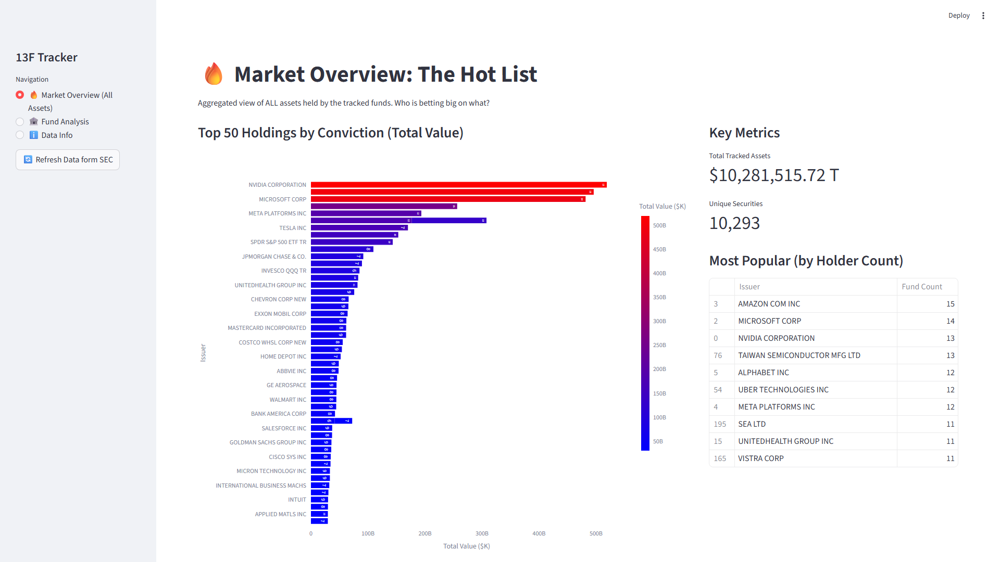

  
# 🐳 SEC 13F Whale Tracker
**Institutional Holdings Dashboard built with Streamlit & Plotly**

## 📌 Project Overview

The **SEC 13F Whale Tracker** is a data dashboard that tracks, visualizes, and audits the quarterly SEC 13F filings of major hedge funds and institutional investors (e.g., Berkshire Hathaway, Appaloosa, Bridgewater).

---

## 📊 Software UI & Features

The dashboard provides a macro-level overview of portfolio shifts, top holdings, and sector allocations of "smart money".

### Key Features:
* **Automated Data Pipelines**: Scrapes and parses raw SEC EDGAR 13F filings.
* **Macro Data Integration**: Integrates with FRED to overlay macroeconomic indicators.
* **Whale Analytics**: Deep dives into specific funds like David Tepper's Appaloosa and Warren Buffett's Berkshire.
* **Interactive UI**: Built on Streamlit with interactive Plotly visualizations for exploring historical positions.

## 🚀 Setup & Execution

1. Install requirements: `pip install streamlit pandas plotly`
2. Start the dashboard: `streamlit run dashboard.py`
3. Access the dashboard at `http://localhost:8501`

---
*Developed as an institutional-grade data engineering and research project.*
